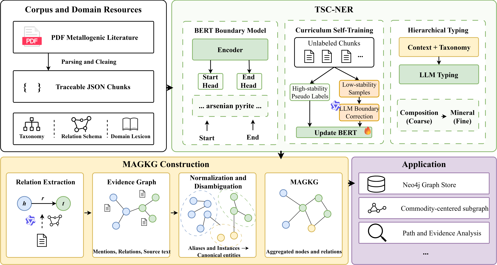
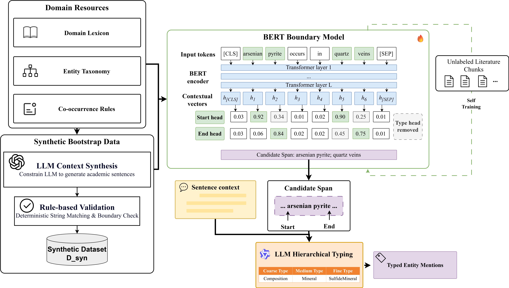
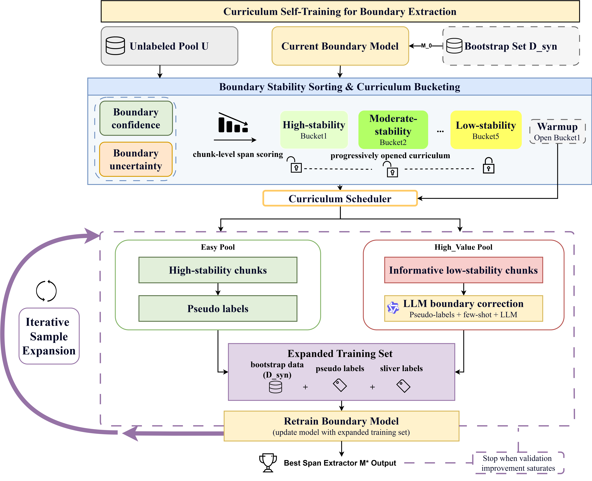
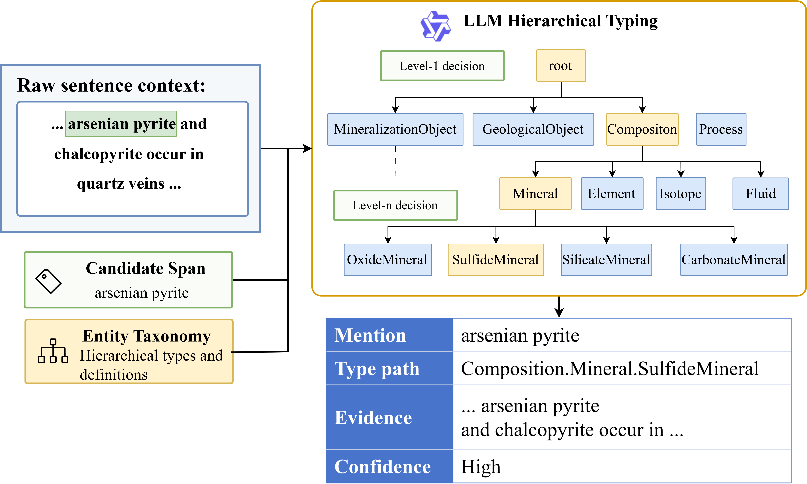

# MAGKG

Public code and data artifacts for **MAGKG**, a hierarchical metallogenic knowledge graph construction framework based on SLM--LLM collaboration.

MAGKG targets knowledge-intensive metallogenic literature, where entity boundaries are often compound, entity types are hierarchical, and extracted facts need schema constraints and evidence links. The repository provides a runnable workflow that follows the main design of the paper: boundary-focused extraction, curriculum-guided training data assembly, hierarchical type assignment, schema-constrained relation extraction, entity normalization, and evidence-preserving canonical graph construction.

- Code: <https://github.com/Kky6/MAGKG>
- Data and model artifacts: <https://huggingface.co/datasets/Kky66/MAGKG>

## Framework



### Boundary-Oriented Extraction



### Curriculum Self-Training



### Hierarchical Type Assignment



## Installation

The demo workflow uses only the Python standard library.

```bash
git clone https://github.com/Kky6/MAGKG.git
cd MAGKG
python --version
```

Python 3.10 or newer is recommended.

## Quick Start

Run the complete local workflow:

```bash
python scripts/run_all.py
```

This command performs four steps. A stage-by-stage description is provided in [docs/PIPELINE.md](docs/PIPELINE.md):

1. validates the MAGKG entity hierarchy and relation schema;
2. builds a curriculum-style boundary training manifest from synthetic examples and pseudo labels;
3. constructs a canonical graph from chunk-level metallogenic KG examples;
4. exports an edge-level evidence table for source tracing.

Expected output:

```text
base_rows: 240
manifest_rows: 242
Nodes: 73; edges: 59
evidence rows: 59
```

You can also run each step separately:

```bash
python scripts/validate_schema.py --schema configs/magkg_schema.json

python scripts/curriculum_boundary_demo.py \
  --base data/synthetic/synthetic_boundary_sample.jsonl \
  --pseudo data/sample_pseudo_pool.jsonl \
  --output outputs/train_manifest_round1.jsonl

python scripts/run_demo.py \
  --input data/kg/kg_trace_chunks.jsonl \
  --schema configs/magkg_schema.json \
  --output outputs/demo_graph.json

python scripts/export_evidence_table.py \
  --graph outputs/demo_graph.json \
  --output outputs/evidence_trace.jsonl
```

## Optional LLM API Configuration

To connect your own LLM service for hierarchical type assignment, relation extraction, or normalization experiments, copy `.env.example` to `.env` and fill in the following fields:

```bash
cp .env.example .env
```

```env
KG_API_BASE=https://your-llm-endpoint.example.com/v1
KG_API_KEY=your_api_key_here
KG_MODEL=your-model-name
KG_TIMEOUT=120
KG_TEMPERATURE=0
```

`KG_API_BASE` should point to an OpenAI-compatible `/chat/completions` endpoint. The repository never stores a real key; 

Check whether the configuration is visible to the code:

```bash
python scripts/check_llm_config.py
```

To send a minimal test request after filling `.env`:

```bash
python scripts/check_llm_config.py --ping
```

## Data Files

### Synthetic Boundary Examples

`data/synthetic/synthetic_boundary_sample.jsonl` contains 240 synthetic boundary examples. Each row stores a sentence, span offsets, type combinations, and sample metadata used by the curriculum manifest builder.

```json
{
  "id": "D_SYN_000001",
  "text": "At the Obuasi deposit, the North orebody ...",
  "spans": [{"text": "Obuasi deposit", "start": 7, "end": 21}],
  "source": "d_syn",
  "round": "d0",
  "sample_weight": 1.0
}
```

### KG Provenance Examples

`data/kg/kg_trace_chunks.jsonl` contains chunk-level KG examples extracted from metallogenic deposit cases. Each row contains typed entities, aliases, schema-valid relations, and provenance fields:

```json
{
  "id": "Phoenix_190656_DOC_C_0893_P03_R001",
  "document_id": "DOC_C_0893",
  "paragraph_id": "DOC_C_0893_P03",
  "chunk_id": "DOC_C_0893_P03_C01",
  "sentence_ids": ["DOC_C_0893_P03_S01"],
  "entities": [{"mention": "gabbro", "type": "RockUnit", "canonical": "gabbro"}],
  "relations": [{"head": "gabbro", "relation": "part_of", "tail": "Phoenix deposit"}]
}
```

`data/kg/kg_trace_triples.jsonl` flattens the same examples into triples with evidence text, chunk text, and paragraph text. `data/kg/canonical_graph_subset.json` is the canonical graph generated from the trace chunks, and `data/kg/evidence_trace.jsonl` is the edge-level evidence table exported from that graph.

## Model Artifacts

The HuggingFace data repository includes a boundary-model checkpoint, decoding thresholds, schema, synthetic boundary data, and KG provenance examples. The local pipeline does not require the checkpoint, but downstream users can use it with compatible span-boundary inference code and the SciBERT backbone.

## Prompts

Compact prompt templates are provided in [docs/PROMPTS.md](docs/PROMPTS.md). They summarize the key principles for hierarchical type assignment, schema-constrained relation extraction, and entity normalization.

## Citation

If you use MAGKG, please cite the paper and this repository. 

